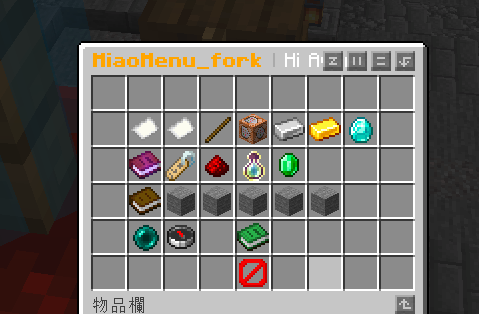
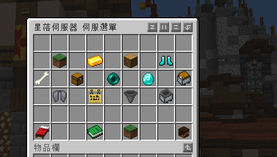
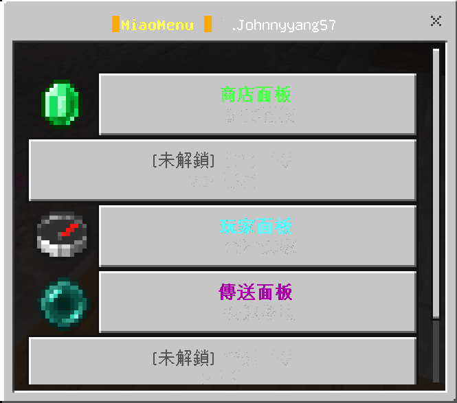
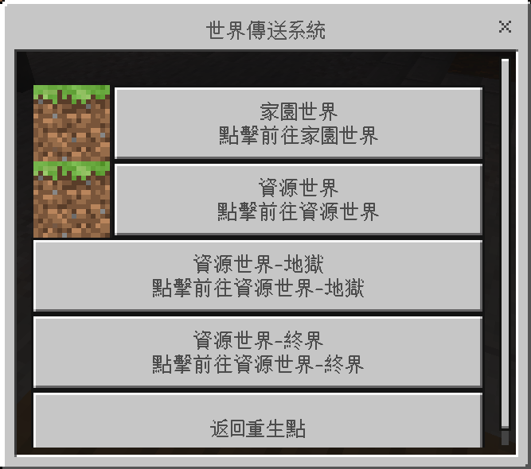
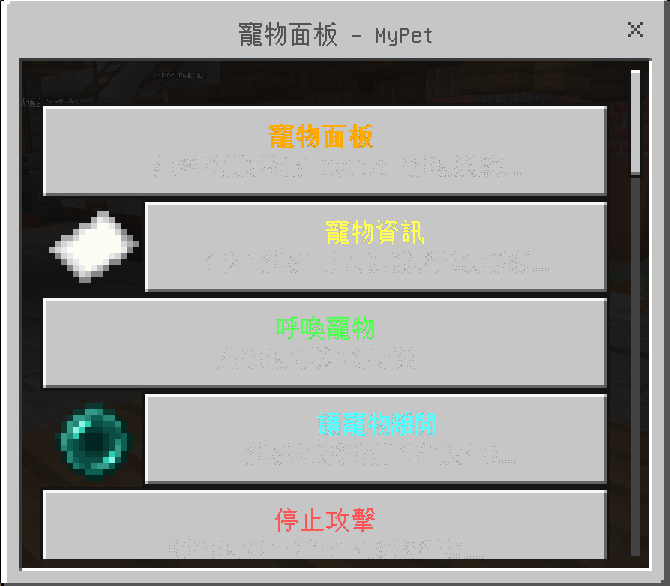

# MiaoMenu_fork / 喵喵選單插件（Fork 版）

繁體中文（台灣） · 其他語言：[English](./docs/README-en.md) · 商店文案：[Store Listing](./docs/store-listing.md)

> 📦 下載 / Modrinth：<https://modrinth.com/plugin/miaomenu_fork>
> Fork：<https://github.com/Avery11111101/MiaoMenu_fork>
> 原作：<https://github.com/Yamada0001/MiaoMenu>
>
### 面向 Paper / Folia / Geyser **26.1.2**（亦相容 26.2 alpha）的輕量級選單插件，同時為 Java 版與基岩版玩家提供原生互動體驗，內建 `en` 英文（預設）與 `zh_TW` 繁體中文雙語切換。

## 向後相容聲明（從原版 MiaoMenu 升級必看）

Fork 版重點放在 **不改使用者操作習慣**：

- 主指令 `/dgeysermenu`、`/dgm`、`/fluxmenu` 全數保留，**額外新增** `/mmf` 別名
- 子指令 `open / reload / help`、`/getmenuclock` 全數保留
- 權限節點 `dgeysermenu.*`、`dgeysermenu.use`、`dgeysermenu.admin`、`dgeysermenu.reload` 全數保留
- `config.yml`、`java_menus/*.yml`、`bedrock_menus/*.yml` 鍵名與結構保留，原本的設定檔可直接帶過來

唯一新增的設定是 `language: en|zh_TW`（缺省即 `en`），並把 `config.yml` 內原本的 `messages:` 區塊搬到 `lang/<language>.yml`。若你升級時保留原 `config.yml`，插件啟動會偵測 `config-version` 自動補上新鍵，不會壞掉舊設定。

### 無痛轉移（自動匯入舊資料夾）

把 `MiaoMenu_fork-1.3.2.jar` 直接丟到 `plugins/`，啟動時插件會自動偵測下列舊版資料夾並整批匯入到 `plugins/MiaoMenu_fork/`：

1. `plugins/DGeyserMenu/`
2. `plugins/dgeysermenu/`
3. `plugins/MiaoMenu/`

匯入只在 `plugins/MiaoMenu_fork/config.yml` **不存在**時觸發；舊資料夾原封不動，新資料夾內會出現舊 `config.yml`、`java_menus/`、`bedrock_menus/`、`lang/` 等檔案。若舊 `config-version` 與本版不符，舊 `config.yml` 會被 ConfigManager 自動備份成 `config.yml.old`，並寫入本版預設值，你可以對照備份檔把自訂值挪到新版即可。

> ℹ️ **DeluxeMenus（`plugins/DeluxeMenus/` 或 `plugins/dmenu/`）走「指令引導匯入」+ 自動轉換**。它的 YAML 結構與本插件不同，所以**不會**在啟動時靜默自動匯入；但你可以用下面的 `/dgm import preview DeluxeMenus` → `apply` 流程把 `gui_menus/` 下的每個選單自動轉換成 `java_menus/<id>.yml`（`size`→`rows`、`[console]`→`[cmd]`、`[openguimenu] X`→`[player] dgm open X`，其他原樣保留）。原 DeluxeMenus 資料夾不會被動到。

### 切換語言（`/dgm lang`、`/mmflang`、`/lang`）

需要 `dgeysermenu.admin` 權限。三種寫法都會路由到同一個 `LangCommand`：

```
/dgm lang                # 顯示目前語言 + 可用語言清單
/dgm lang zh_TW          # 切換為繁中並即時 reload 所有訊息
/mmflang zh_TW           # 同上短捷
/lang zh_TW              # 同上更短捷（注意：可能被其他插件搶走）
```

> ⚠️ `/lang` 是 `/mmflang` 在 plugin.yml 上掛的 alias。若伺服器同時裝了其他宣告 `/lang` 的插件（例如 LiteBans），Bukkit 會依插件載入順序決定誰先註冊到，本插件不會自動覆蓋。此時請改用 `/mmflang zh_TW` 或 `/dgm lang zh_TW`，效果完全相同。

切換後 `/dgm help`、所有錯誤訊息、選單鎖定文字都會跟著語系變動，**不需重啟伺服器**。如果你想自訂語言，把 `<語言碼>.yml` 放到 `plugins/MiaoMenu_fork/lang/` 下，重啟或 `/dgm lang <語言碼>` 即可載入。

### 關於插件（`/dgm about`）

顯示插件版本、Fork / 原作 GitHub 連結、Modrinth 下載頁；若 Modrinth 上偵測到新版本，也會在訊息底部附上提示。**啟動時也會把同一份資訊印到主控台**，方便維運。

擁有 `dgeysermenu.admin` 權限的管理員上線（join）時，若插件啟動時已從 Modrinth 抓到比目前版本更新的版號，就會主動推一條訊息提示去 Modrinth 下載。普通玩家不受打擾。

### Floodgate 辨識診斷（`/dgm whoami`，1.3.2 新增）

當基岩玩家明明已透過 Floodgate 連進來，卻被當成 Java 玩家看到箱子 GUI 時（典型情境：Velocity 後端 `key.pem` 未對齊、`player-info-forwarding-mode` 設定錯誤、玩家掛了 linked Java 帳號），用 `/dgm whoami` 一次把所有環節印出來：

- `floodgate plugin` 與 `Geyser-Spigot plugin` 的版本與啟用狀態
- 你的 UUID（基岩玩家通常以 `00000000-0000-0000` 開頭）
- smart-dispatch 最終判定（true ＝會走 Floodgate SimpleForm 原生 UI；false ＝會走箱子 GUI）
- `FloodgateApi.isFloodgatePlayer(uuid)` 反射回傳
- Floodgate 登記的 Bedrock username、XUID、linkedPlayer 狀態
- 若反射失敗，會印出例外型別與訊息（不會把整段 stack trace 噴給玩家）

無需額外權限，僅顯示呼叫者自己的資訊（玩家專用）。

### 指令引導的手動匯入（`/dgm import`）

若插件已經運行過、`config.yml` 已存在，自動匯入不會觸發。此時可用 `/dgm import` 系列指令在伺服器上手動補匯入（需要 `dgeysermenu.import` 或 `dgeysermenu.admin` 權限，預設 OP）：

```
/dgm import scan                                     # 掃描 plugins/ 內可匯入的資料夾
/dgm import preview <來源>                            # 預覽差異（新增 / 略過 / 衝突），產生 8 碼確認碼
/dgm import apply   <來源> <確認碼> [--overwrite|--rename]
                                                     # 帶確認碼才會落盤；衝突檔自動備份到 backups/
/dgm import rollback [備份ID]                         # 從備份還原（不帶參數＝最近一份）
```

**支援的來源**：

| 來源資料夾 | 策略 | 說明 |
|------------|------|------|
| `plugins/DGeyserMenu/` | 整批檔案複製 | 同 schema，直接搬 |
| `plugins/dgeysermenu/` | 整批檔案複製 | 同上 |
| `plugins/MiaoMenu/` | 整批檔案複製 | 同上 |
| `plugins/DeluxeMenus/` | **自動轉換** | 讀 `config.yml.gui_menus:` 列表，把 `gui_menus/` 內每個選單轉成 `java_menus/<id>.yml`（`size→rows`、`[console]→[cmd]`、`[openguimenu] X→[player] dgm open X`）|
| `plugins/dmenu/` | **自動轉換** | DeluxeMenus 的舊名稱，同上 |

安全保證：
- 預覽必先於套用，且 5 分鐘內未 apply 即失效
- 衝突檔在覆寫前一律備份到 `plugins/MiaoMenu_fork/backups/import-<時戳>/`，保留最近 5 份
- 套用 / 還原成功後自動 reload（行為與 `/dgm reload` 一致）
- 預設衝突策略為 `SKIP`；`--overwrite` 直接覆寫、`--rename` 把舊版加 `.imported` 後綴並排存放
- DeluxeMenus 轉換時，原資料夾完全不會被動到；轉換後的 yaml 頂部會有中文註解標註來源與動作 prefix 對應，方便手動微調

## 專案概覽

MiaoMenu_fork 是一款雙端選單插件：

- Java 玩家使用箱子 GUI 選單
- 基岩玩家使用 Floodgate 表單選單
- 自動識別玩家類型並開啟對應選單
- 支援 PlaceholderAPI、跨服跳轉、熱重載與條件系統
- 內建選單時鐘、範例選單與權限控制
- 訊息抽出為獨立 `lang/<language>.yml`，繁中／英文可即時切換

目前版本：`1.3.2`（在 `1.3.1` 之上新增 `/dgm whoami` 診斷指令，一行打進去就能看出 Floodgate 對你這位玩家的真實辨識結果：plugin 版本／enabled、`isFloodgatePlayer(uuid)` 回傳、UUID prefix、Bedrock username／XUID、`linkedPlayer` 狀態，以及 smart-dispatch 最終判定走 Java 還是基岩分支。專為「基岩玩家在 Velocity 後端卻看到 Java 箱子 GUI」這類疑難排查設計，任何一行回 `false` ／ `null` 即指出哪段環節壞掉，不必再翻 server log。**對既有指令／設定檔／權限／玩家操作完全零影響**，純粹附加。原作為 [Yamada0001/MiaoMenu](https://github.com/Yamada0001/MiaoMenu) 2.7.7.9）

## 介面預覽

### Java 選單預覽




### 基岩選單預覽





## 核心優點

### 1. 雙版本原生選單體驗
- Java 玩家看到熟悉的箱子選單
- 基岩玩家看到適配行動裝置的原生表單
- 插件內部自動分流，無需手動區分指令入口

### 2. 面向實際伺服器場景
- 支援 PlaceholderAPI 動態變數
- 支援 Floodgate / Geyser 場景下的基岩玩家選單
- 支援 Velocity / BungeeCord 風格的跨服連線指令
- 支援 CraftEngine 自訂物品備援材質

### 3. 條件系統完整
- 支援選單級 `view_requirement`
- 支援物品級 `conditions`
- 支援可重複使用的 `requirement_blocks`
- 支援 `deny_message` 與 `fallback_menu`
- 支援權限、進度、計分板、成就、佔位符比對等條件

### 4. 運維體驗友善
- 支援設定熱重載
- 範例選單檔可自動產生
- 選單時鐘支援自動發放、死亡保護、右鍵開啟選單
- **訊息抽離至 `lang/`**：所有可見文字統一由 `lang/<language>.yml` 管理，方便外包翻譯

### 5. 相容既有設定思路
- Java 選單結構與 DeluxeMenus 風格接近
- 對傳統 YAML 選單伺服器管理方式更友善

## 多語系（Fork 新增）

仿照同作者 [AFly](https://github.com/Avery11111101/AFly) 的架構：

- 內建語系：`en`（預設）、`zh_TW`（繁體中文）
- 自訂語系：在 `plugins/MiaoMenu_fork/lang/` 內新增 `<code>.yml` 即可
- 切換方式：編輯 `config.yml` 的 `language: en|zh_TW|...` 後 `/dgm reload`，或直接覆寫 lang 檔，熱重載會即時生效
- 缺少的鍵會自動 fallback 到 jar 內 `lang/en.yml`，不會出現空訊息

## 功能總覽

### Java 選單
Java 選單位於 `src/main/resources/java_menus/`，支援：

- `menu_title`
- `rows`
- `items.<id>.slot`
- `material`
- `custom_model_data`
- `display_name`
- `lore`
- `left_click_commands`
- `right_click_commands`
- `conditions`
- `lock_message`
- `view_requirement`

範例檔：
- `test.yml`
- `server-selector.yml`

### 基岩選單
基岩選單位於 `src/main/resources/bedrock_menus/`，支援：

- `menu.title`
- `menu.subtitle`
- `menu.footer`
- `menu.items[*].text`
- `icon`
- `icon_type`
- `command`
- `execute_as`
- `conditions`
- `lock_message`
- `view_requirement`

### 智慧選單開啟邏輯
插件會自動判斷：

- 若玩家是 Floodgate 基岩玩家，開啟基岩選單
- 否則開啟 Java 選單

意味著同一個指令入口可以同時服務兩類玩家。

### 指令系統
插件註冊了以下指令：

```text
/dgeysermenu open <menu-name>
/dgeysermenu reload
/dgeysermenu help
/dgm open <menu-name>
/dgm reload
/dgm help
/fluxmenu open <menu-name>
/mmf open <menu-name>
/getmenuclock
```

說明：
- `dgm`、`fluxmenu`、`mmf` 都是主指令別名
- `open` 用於開啟指定選單
- `reload` 用於重新載入設定與選單檔
- `help` 用於顯示說明
- `getmenuclock` 用於取得選單時鐘
- `whoami`（1.3.2 新增）用於印 Floodgate 對你的辨識結果，排查「基岩玩家被當 Java 玩家」的疑難雜症

### 選單時鐘
選單時鐘是插件的特色功能：

- 玩家加入時可自動取得時鐘
- 若時鐘遺失，可自動補發
- 玩家死亡時，選單時鐘不會掉落
- 玩家右鍵時鐘即可開啟預設選單
- 時鐘名稱由 `lang/<language>.yml` 的 `menu.clock.name` 控制

### 熱重載
在設定中啟用後：

- 儲存設定檔後可自動重新整理選單
- 儲存 `lang/*.yml` 後語系即時切換，無需 `/dgm reload`
- 無需頻繁重新啟動伺服器
- 更適合高頻除錯選單配置與按鈕邏輯

### 跨服支援
插件支援代理環境中的跨服連線指令：

- 可偵測 Velocity 模式
- 可偵測 BungeeCord 風格通道
- 選單按鈕可執行類似 `server lobby` 的跳轉邏輯

範例見 `server-selector.yml`。

### PlaceholderAPI 支援
若伺服器安裝了 PlaceholderAPI，可在：

- `display_name`
- `lore`
- 條件判斷中的佔位符
- 選單提示文字

中使用動態變數，例如：

```yaml
display_name: "&b%player_name%"
lore:
  - "&f等級: &e%player_level%"
  - "&f金幣: &6%vault_eco_balance%"
```

## 安裝方法

### 環境需求
- Java 21
- Paper / Folia **26.1.2**（亦相容 26.2 alpha）或相容實作
- 若需基岩選單：安裝 Floodgate（建議 2.2.5+）與 Geyser（建議 2.10.x）
- 若需佔位符解析：安裝 PlaceholderAPI
- 若需跨服跳轉：建議在代理環境（Velocity / BungeeCord）下使用

### 安裝步驟
1. 將插件 jar 放入伺服器 `plugins` 目錄
2. 啟動伺服器
3. 首次啟動後會產生設定、`lang/`、範例選單
4. 依需求修改 `config.yml`、`lang/<language>.yml`、`java_menus/`、`bedrock_menus/`
5. 使用 `/dgm reload` 或重新啟動伺服器使設定生效

## 權限節點

來自 `plugin.yml` 的權限定義如下：

```yaml
dgeysermenu.*:
  children:
    dgeysermenu.use: true
    dgeysermenu.admin: true
    dgeysermenu.reload: true

dgeysermenu.use:
  default: true

dgeysermenu.admin:
  default: op

dgeysermenu.reload:
  default: op
```

### 權限說明
- `dgeysermenu.use`：允許使用選單基礎指令
- `dgeysermenu.admin`：允許使用管理功能與取得選單時鐘
- `dgeysermenu.reload`：允許重新載入設定
- `dgeysermenu.*`：授予全部權限

### 額外建議
在選單條件中，你還可以自行引用其他權限節點，例如：

```yaml
requirements:
  - type: permission
    permission: vip.shop
```

這類權限並非插件固定註冊項，但可作為業務條件判斷使用。

## 設定檔詳解

主設定檔：`src/main/resources/config.yml`

### 頂層版本欄位
```yaml
config-version: 16
menu-version: 6
language: en
```

- `config-version`：設定檔版本驗證（本 Fork 版為 16）
- `menu-version`：範例選單版本驗證
- `language`：要載入的語系（對應 `lang/<language>.yml`；預設 `en`）

### 開啟選單音效
```yaml
settings:
  open-menu-sound:
    enabled: true
    sound: "entity.experience_orb.pickup"
    volume: 1.0
    pitch: 1.0
```

說明：
- `enabled`：是否啟用開啟選單音效
- `sound`：要播放的原版音效鍵名
- `volume`：音量
- `pitch`：音調

### 預設選單
```yaml
settings:
  default-menu: "test"
```

玩家右鍵選單時鐘時，會開啟這裡指定的預設選單。

### 熱重載
```yaml
settings:
  hot-reload:
    enabled: true
```

啟用後，儲存選單檔或 `lang/` 內檔案時會嘗試自動重新整理。

### 自動產生範例
```yaml
settings:
  auto-generate-examples: true
```

啟用後，缺少範例選單時會自動補全。

### 代理網路支援
```yaml
settings:
  velocity-network: true
```

說明：
- 為 `true` 時優先以 Velocity 網路模式處理
- 適用於需要跨服連線指令的場景

### 自訂物品備援材質
```yaml
settings:
  item-resolver:
    fallback-material: STONE
```

當外部物品提供方不可用時，插件會備援到這裡指定的原版材質。

### 選單時鐘
```yaml
settings:
  menu-clock:
    enabled: true
    give-on-join: true
```

說明：
- `enabled`：是否啟用選單時鐘功能
- `give-on-join`：玩家加入時若沒有時鐘則自動給予

### 訊息系統（已遷移至 lang）
Fork 版把原本 `config.yml` 內 `messages:` 的所有文字搬到了 `lang/<language>.yml`，鍵名保持不變：

```yaml
# lang/en.yml 範例
message:
  no-permission: "&c✦ You do not have permission to use this command."
  players-only: "&c✦ Only players can use this command."
  menu-not-found: "&c✦ No menu named &e{0}&c was found. Please check the spelling."
```

```yaml
# lang/zh_TW.yml 範例
message:
  no-permission: "&c✦ 權限不足，你無法觸碰這道指令。"
  players-only: "&c✦ 只有身歷其境的冒險者（玩家）才能使用此令。"
  menu-not-found: "&c✦ 未曾見過名為 &e{0}&c 的選單，請檢查拼字。"
```

說明：
- 所有可見提示文字統一由 `lang/<language>.yml` 管理
- 想要新增語系，複製 `en.yml` 改名為 `<code>.yml` 即可
- 缺少的鍵會自動 fallback 到 jar 內 `lang/en.yml`

## Java 選單設定範例解釋

範例檔：`src/main/resources/java_menus/test.yml`

```yaml
menu_title: "&6&lMain Menu &7| &fServer Name"
rows: 6
view_requirement:
  deny_message: "&cYou cannot open this menu yet."
  fallback_menu: "test"
  requirements:
    - type: permission
      permission: dgeysermenu.use
items:
  server_info:
    slot: 10
    material: KNOWLEDGE_BOOK
    custom_model_data: 0
    display_name: "&e&lServer Info"
    lore:
      - "&7Click to view server information"
      - "&fOnline Players: &a%server_online%&f/&a%server_max_players%"
    left_click_commands:
      - "[message] &6=== Server Info ==="
      - "[player] list"
      - "[close]"
```

### 這段代表什麼
- `menu_title`：箱子選單標題
- `rows`：選單行數，只能是 1 到 6
- `view_requirement`：玩家能否開啟整個選單
- `deny_message`：不符合需求時送出的提示
- `fallback_menu`：不符合需求時跳轉的替代選單
- `slot`：按鈕放在哪個格子
- `material`：按鈕材質
- `custom_model_data`：材質包模型編號
- `display_name`：按鈕標題
- `lore`：按鈕說明
- `left_click_commands`：左鍵點擊執行的動作清單

### 支援的材質來源
`test.yml` 中已寫明，`material` 可以來自多種來源：

- 原版材質，如 `PAPER`
- 原版材質 + `custom_model_data`
- `craftengine:namespace:item_id`
- `itemsadder:namespace:item_id`
- `mmoitems:type:id`
- `headdb:head_id`
- `base64head:base64_string`

## Java 選單中的條件系統

### 物品條件範例
```yaml
player_info:
  conditions:
    operator: AND
    requirements:
      - type: placeholder_contains
        placeholder: "%player_name%"
        value: ""
  lock_message: "&cYou do not meet the requirements to view player info yet."
```

說明：
- `conditions`：物品級條件判斷
- `operator`：多個條件之間的關係，可為 `AND` 或 `OR`
- `placeholder_contains`：判斷佔位符結果是否包含指定值
- `lock_message`：不符合條件時點擊按鈕顯示的文字

### 複雜條件範例
```yaml
shop:
  conditions:
    operator: AND
    requirements:
      - type: advancement
        advancement: "minecraft:story/root"
    children:
      - operator: OR
        requirements:
          - type: permission
            permission: "vip.shop"
          - type: progress
            objective: "trade_count"
            value: 5
```

這個範例表示：
- 玩家必須先完成指定的成就
- 然後再符合以下任一條件：
  - 擁有 `vip.shop` 權限
  - 計分板 `trade_count` 至少達到 5

## 基岩選單設定範例解釋

範例檔：`src/main/resources/bedrock_menus/test.yml`

```yaml
menu:
  title: "§6§lMain Menu"
  subtitle: "§7Welcome to the server!"
  footer: "§8Server version 26.1.x"
  items:
    - text: "§a§lTeleport\n§7Quickly travel to different locations"
      icon: "textures/items/compass_item"
      icon_type: "path"
      command: "warp"
      execute_as: "player"
view_requirement:
  deny_message: "&cYou cannot open the Bedrock main menu right now."
  fallback_menu: "test"
  requirements:
    - type: permission
      permission: dgeysermenu.use
```

### 欄位說明
- `title`：表單標題
- `subtitle`：副標題
- `footer`：頁尾
- `items`：按鈕清單
- `text`：按鈕顯示文字
- `icon`：圖示路徑或 URL
- `icon_type`：圖示類型
- `command`：點擊後執行的指令
- `execute_as`：以玩家或主控台身分執行
- `view_requirement`：選單整體存取條件

## 跨服選單範例

範例檔：`src/main/resources/java_menus/server-selector.yml`

```yaml
items:
  lobby:
    left_click_commands:
      - "[player] server lobby"
      - "[message] &aConnecting to lobby..."
      - "[close]"
```

這類寫法適合：
- Velocity 網路
- BungeeCord 風格代理網路
- 大廳服 / 生存服 / 創造服 / 小遊戲服切換入口

## 進階玩法範例

### 1. 開啟另一個選單
```yaml
left_click_commands:
  - "[menu] shop"
```

### 2. 給玩家送出提示
```yaml
left_click_commands:
  - "[message] &a歡迎使用選單!"
```

### 3. 讓玩家執行指令
```yaml
left_click_commands:
  - "[player] spawn"
```

### 4. 讓主控台執行指令
```yaml
left_click_commands:
  - "[console] give %player_name% diamond 1"
```

### 5. 關閉選單
```yaml
left_click_commands:
  - "[close]"
```

## 目錄結構

```text
MiaoMenu_fork/
├─ pic/
├─ docs/
├─ src/main/resources/
│  ├─ config.yml
│  ├─ plugin.yml
│  ├─ lang/
│  │  ├─ en.yml
│  │  └─ zh_TW.yml
│  ├─ java_menus/
│  │  ├─ test.yml
│  │  └─ server-selector.yml
│  └─ bedrock_menus/
│     └─ test.yml
```

## 建置方法

```bash
mvn test
mvn package
```

預設產物 `MiaoMenu_fork-1.3.2.jar` 會生成在 `target/` 目錄下。

## 常見問題

### 1. 選單打不開
請依序檢查：
- 玩家是否擁有 `dgeysermenu.use`
- 選單檔名與指令中的選單名是否一致
- YAML 縮排是否正確
- `view_requirement` 是否拒絕了目前玩家

### 2. 基岩選單沒有顯示
請檢查：
- Floodgate 是否正確安裝
- 玩家是否確實透過 Floodgate 連線
- `bedrock_menus/` 是否存在對應選單

### 3. 按鈕點擊後沒有效果
請檢查：
- `command` 或點擊動作是否寫錯
- 玩家本身是否有執行目標指令的權限
- 主控台是否報錯

### 4. 佔位符沒有替換
請檢查：
- PlaceholderAPI 是否已安裝
- 使用的佔位符是否來自已安裝的擴充
- 寫法是否正確

### 5. 跨服指令無效
請檢查：
- 代理環境是否正確運作
- `velocity-network` 設定是否符合你的網路架構
- 代理轉發與通道是否可用

### 6. 訊息變成英文／繁中沒生效
請檢查：
- `config.yml` 的 `language` 是否填正確（`en` / `zh_TW`）
- `plugins/MiaoMenu_fork/lang/<language>.yml` 是否存在
- 是否執行了 `/dgm reload` 或開啟熱重載

## 適用場景

MiaoMenu_fork 適合以下伺服器：

- 同時服務 Java 與基岩玩家
- 需要主選單、功能導覽、伺服器選擇器
- 希望使用 YAML 快速設定選單
- 希望結合 PlaceholderAPI 顯示動態資料
- 希望以低維護成本實作條件選單系統
- 需要英文／繁中雙語介面

## 更新日誌

完整版本歷程獨立放在根目錄的 [更新日誌.md](./更新日誌.md)（繁中 + 英文雙語）。

## 鳴謝

- 原作：[Yamada0001/MiaoMenu](https://github.com/Yamada0001/MiaoMenu) — 沒有原版就沒有這個 Fork
- 多語系架構靈感：[Avery11111101/AFly](https://github.com/Avery11111101/AFly)

## License

本專案使用 `LICENSE` 檔案中宣告的授權條款。
